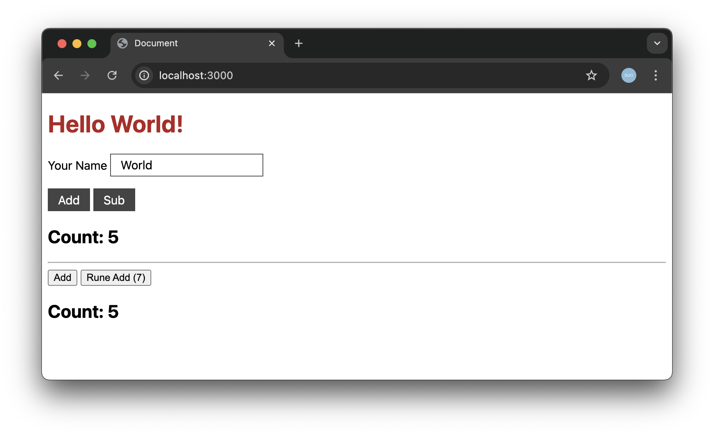

# Svelte Shared

Simple example app of how to build svelte so it can be linked to from separate pre-bundled components.

2 Entry points - `index1.js` and `index2.js`. To prove they're sharing a runtime I have a single store linking both counters. Also added a rune to the second component to ensure this is svelte5. 




## Setup

```
git clone git@github.com:crisward/svelte-shared.git
cd svelte-shared
npm install
npm run build
```

## View with

```
npx serve
```

## Notes

Key things to note are

* See index.html from the use of import maps, these link the import statements with the correct bits of code
* See rollup.config.js to see how the bundles are created.